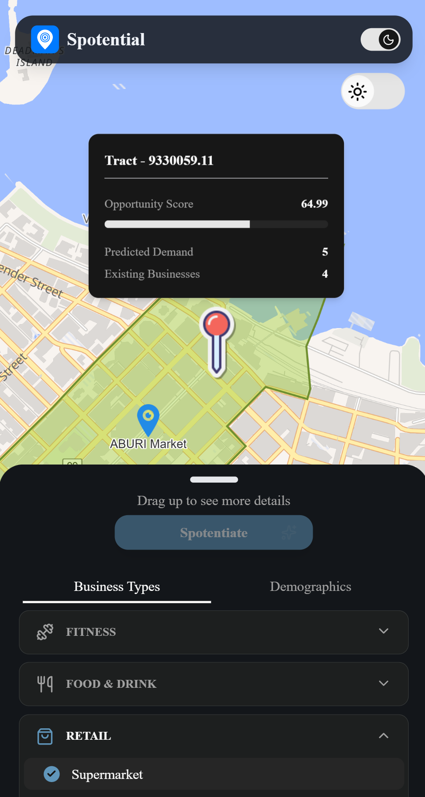

# 📍 Spotential

> Location intelligence platform that helps identify underserved business opportunities in Vancouver using machine learning, demographic analysis, and geospatial data.

🌐 **Live Demo:** https://spotential.brianctb.dev

---

## Preview

### Desktop


### Mobile



---

## Features

### Interactive Geospatial Analysis

- Click anywhere in Vancouver to analyze a location
- Real-time spatial queries using PostGIS
- Interactive MapLibre-powered map interface

### Machine Learning Opportunity Scoring

- Custom XGBoost regression model
- Scores business potential based on:
  - Demographics
  - Business density
  - Population metrics

### Demographic Insights

- Population density
- Household income
- Education statistics
- Working-age population metrics
- Opportunity gap detection

### Mobile-Friendly UI

- Responsive drawer-based mobile experience
- Optimized for touch interaction
- Interactive map + analysis workflow

---

## Why I Built This

I wanted to explore how machine learning and geospatial analysis could be combined to evaluate real-world business opportunities using demographic and location-based data.

Spotential started as an experiment in spatial data analysis and evolved into a full-stack location intelligence platform capable of:

- Running geospatial queries against PostGIS
- Scoring locations using a custom XGBoost model
- Aggregating demographic and census datasets
- Detecting opportunity gaps based on business density
- Visualizing insights through an interactive map-driven UI
- Delivering a responsive mobile-first experience

One of the most interesting challenges was connecting spatial database operations, ML inference, and frontend interaction into a workflow that felt fast and intuitive for users.

The project also gave me hands-on experience with:

- Geospatial indexing and spatial querying with PostGIS
- ML inference pipelines and model serialization with MLFlow
- Full-stack architecture using Next.js + FastAPI
- Mobile interaction patterns and draggable map overlays
- Data preprocessing and feature engineering pipelines
- Deployment workflows across Vercel, Railway, and Neon

---

## Tech Stack

### Frontend

| Stack          |
| -------------- |
| Next.js 15     |
| React          |
| TypeScript     |
| Tailwind CSS   |
| shadcn/ui      |
| MapLibre       |
| TanStack Query |
| Zustand        |

### Backend

| Stack       |
| ----------- |
| FastAPI     |
| Pydantic v2 |
| PostgreSQL  |
| PostGIS     |
| SQLModel    |
| Alembic     |
| uv          |

### Data Science & ML

| Stack        |
| ------------ |
| XGBoost      |
| scikit-learn |
| Polars       |
| GeoPandas    |
| MLflow       |

---

## Architecture

```text
Frontend (Next.js)
        ↓
FastAPI Backend
        ↓
PostgreSQL + PostGIS
        ↓
ML Inference Pipeline
```

---

## Getting Started

### Prerequisites

- Node.js 20+
- pnpm
- Python 3.12+
- uv

### Install uv

See the official installation guide:

https://github.com/astral-sh/uv

---

## Backend Setup

```bash
cd backend

# Install dependencies
uv sync

# Start FastAPI server
uv run fastapi dev
```

or

```bash
cd backend

# Build the backend image
docker build -t spotential-backend .

# Run the container
docker run -p 8000:8000
```

Backend runs on:

```text
http://localhost:8000
```

---

## Frontend Setup

```bash
cd frontend

# Install dependencies
pnpm install

# Start Next.js app
pnpm dev
```

Frontend runs on:

```text
http://localhost:3000
```

---

## Future Improvements

- Agentic AI layer
- Expand area available for analysis
- Expand and refine business types, such as cuisine for resturant, for users to analyze
- Comparison feature between tract

- See more future improvements for ML in [ML Architecture](./ML_ARCHITECTURE.md)

---

## Additional Documentation

- [Roadmap](./ROADMAP.md)
- [ML Architecture](./ML_ARCHITECTURE.md)

---

## Deployment

| Service  | Platform        |
| -------- | --------------- |
| Frontend | Vercel          |
| Backend  | Railway         |
| Database | Neon PostgreSQL |
